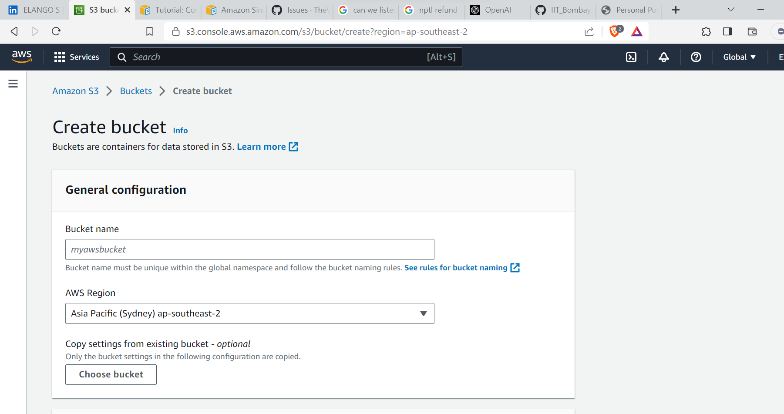
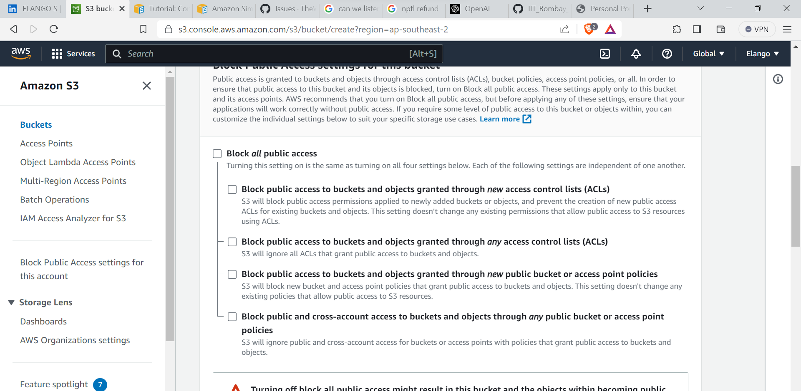
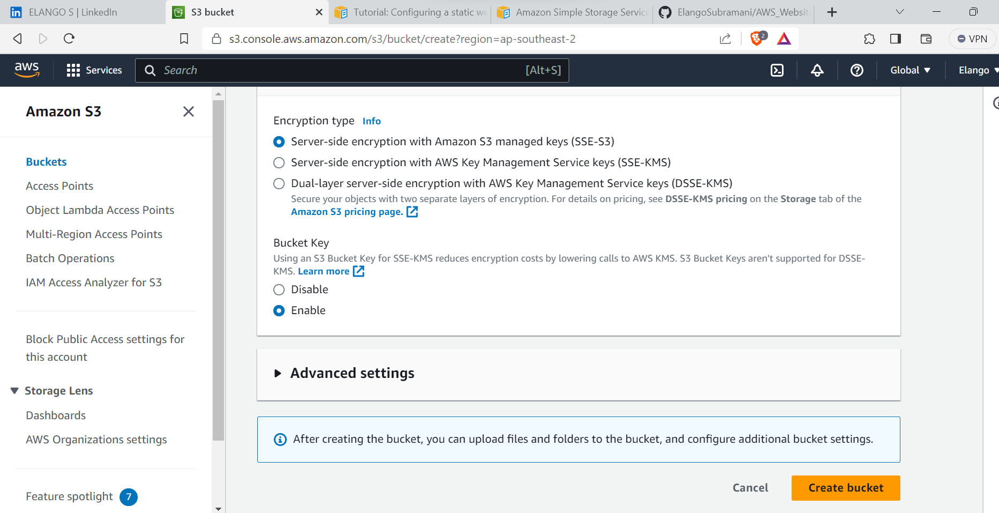
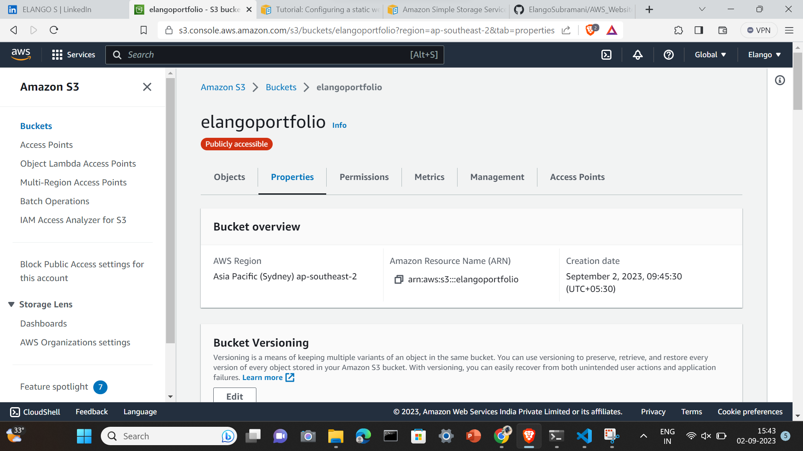
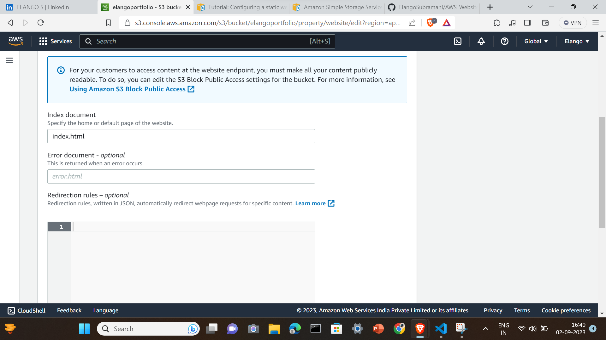
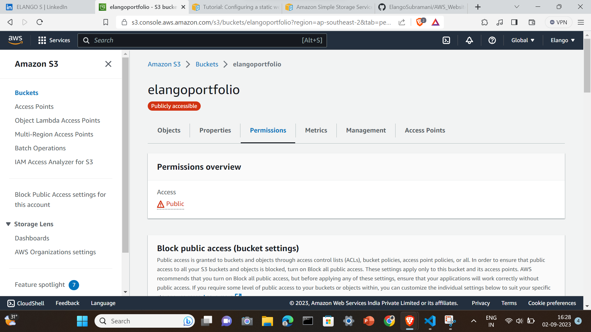
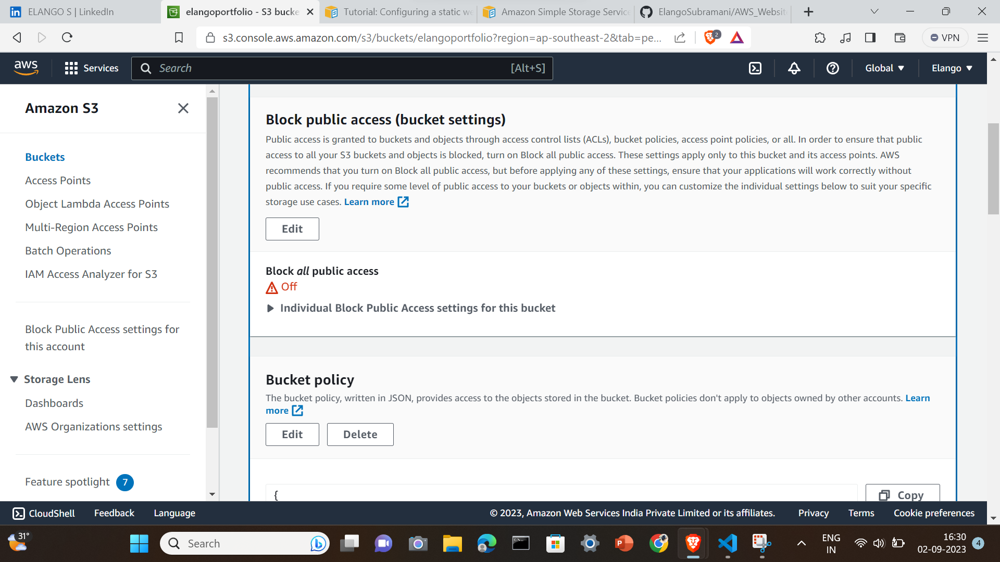
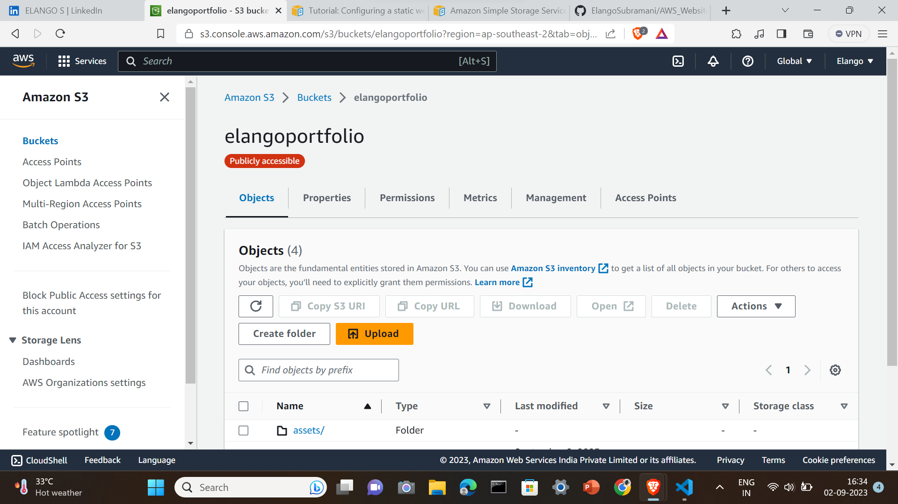
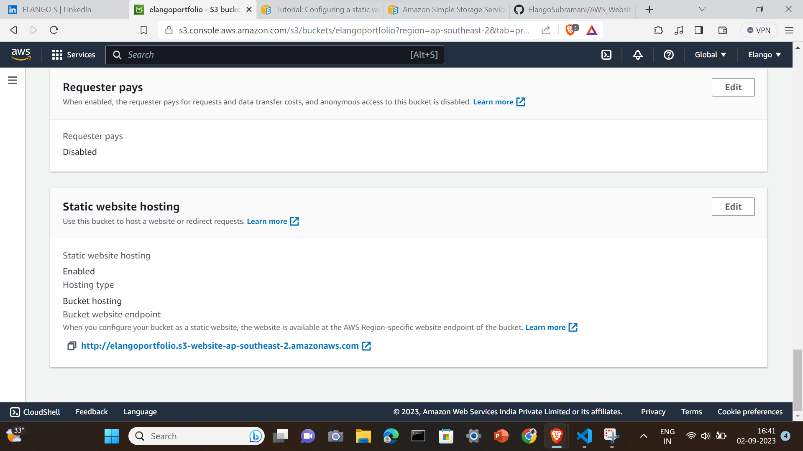

## In this Documentation you'll get to know how simply you can host a static website in AWS S3 in AWS free tire account

<h4>Checkout my website:</h4> 
http://elangoportfolio.s3-website-ap-southeast-2.amazonaws.com/

 

###  Sign up for a AWS account you will get 5GB free Tire AWS Accout for one Year

1. Search AWS S3 in the search bar

 

2. Select AWS S3 (Simple Storage Service) and select Buckets

3. In Buckets you have to create new bucket by selecting Create Bucket 

4.  Name the bucket as per the naming convention and Unmark the block all public Access

5. Now click create bucket don't change any other configurations

6. Tada!!! Now Your AWS S3 bucket created, Inside that go to the properties tab

7. Scroll Down to the last and click edit Static web Hosting

8. Enable the the Static Web Hosting and type your html document name eg.Index.html

9. Now select the Permissions tab and edit the bucket policy

10. Clear the existing policy if anything already avilable, paste the below configuration
{
    "Version": "2012-10-17",
    "Statement": [
        {
            "Sid": "PublicReadGetObject",
            "Effect": "Allow",
            "Principal": "*",
            "Action": "s3:GetObject",
            "Resource": "arn:aws:s3:::replace with yout domain name/*"
        }
    ]
}

11. Now it's time to upload the our html,css,javascript files

12. Click upload and select the requireed files or folders 

13. After uploding again come to properties tab scroll down to the last find the hosted link.

# Full Documetation by AWS

https://docs.aws.amazon.com/pdfs/AmazonS3/latest/userguide/s3-userguide.pdf#HostingWebsiteOnS3Setup

### Boom!! Your website now hosted in AWS S3

## Happy Learning

## Follow me and visit my profile  and if any queries ask me on linkedin

https://github.com/ElangoSubramani 

