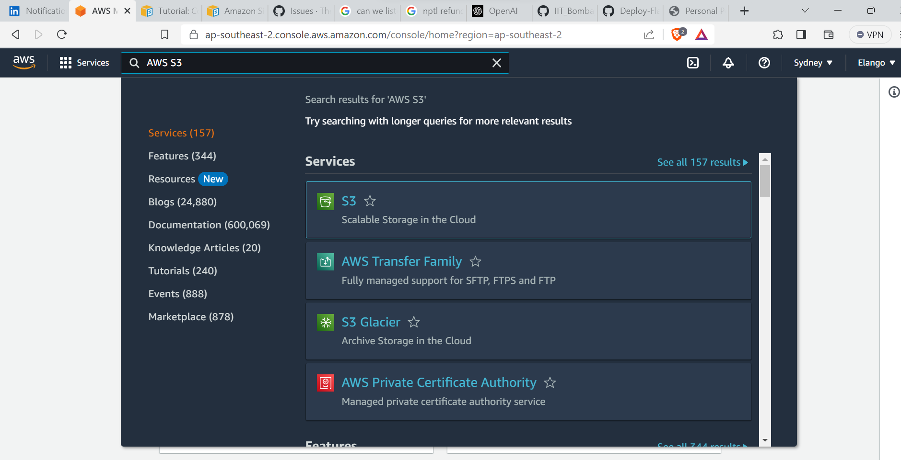
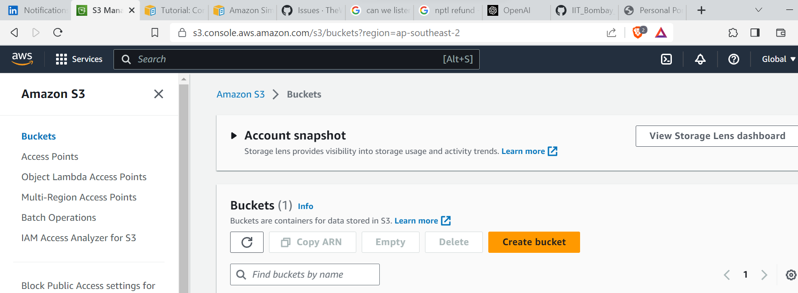
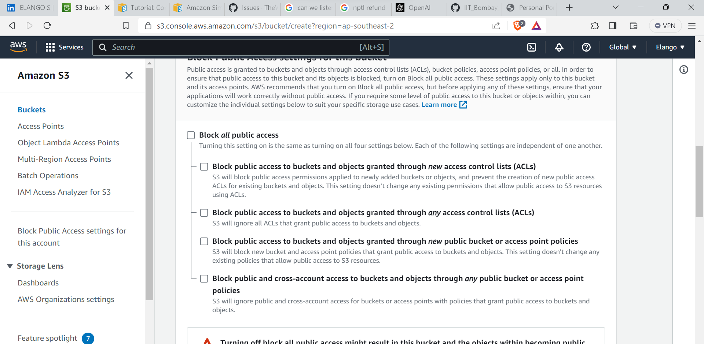
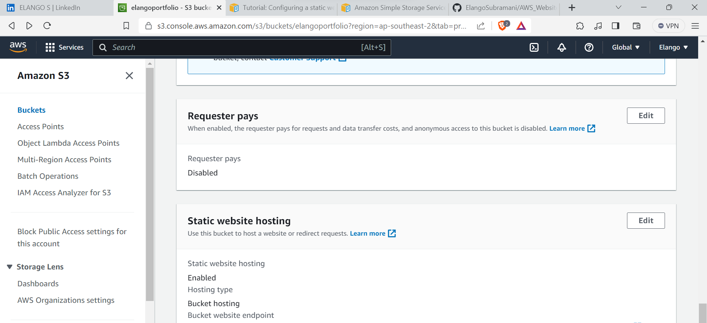
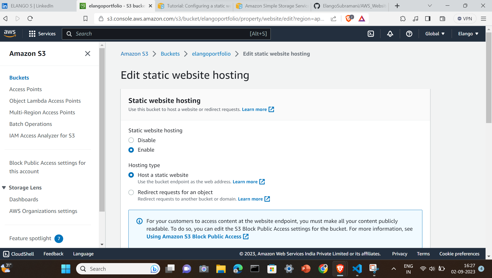
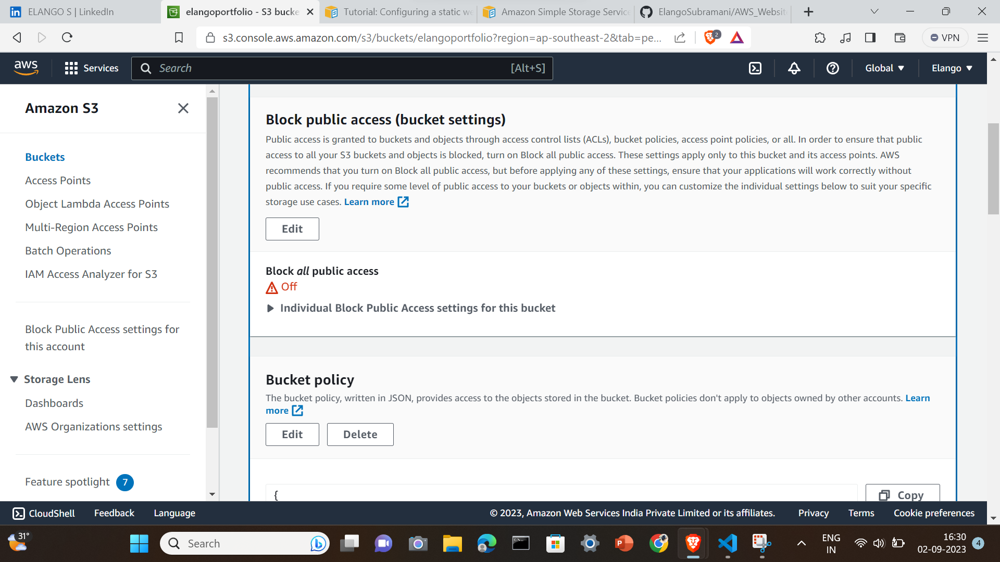
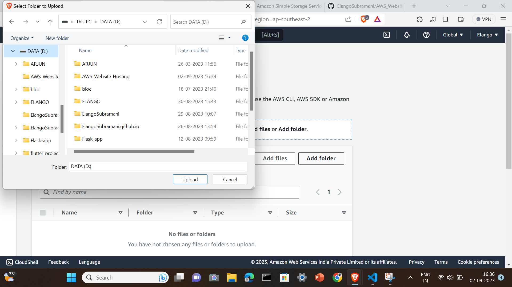

## In this document you'll get to know how to host your static website in AWS S3 in AWS Free Tire Account

### 1. Sign up for a AWS account you will get 5GB free Tire AWS Axccout for one Year

1. Search AWS S3 IN THE SEARCH BAR

 

2. Select AWS S3 (Simple Storage Service) and select Buckets

3. In Buckets you have to create new bucket by selecting Create Bucket 

4.  Name the bucket as per the naming convention and Unmark the bloc all public Access

5. Now click create  Bucket don't change any other configurations

6. Tada!!! Your AWS S3 bucket created, Inside that go to the properties tab

7. Scroll Down to the last and click edit Static web Hosting

8. Enable the the Static Webhosting

9. Now select the Permissions tab and edit the bucket policy

10. Clear the existing poolicy if anything already avilable, paste the below configuration
{
    "Version": "2012-10-17",
    "Statement": [
        {
            "Sid": "PublicReadGetObject",
            "Effect": "Allow",
            "Principal": "*",
            "Action": "s3:GetObject",
            "Resource": "arn:aws:s3:::replace with yout domain name/*"
        }
    ]
}
11. Now it's time to upload the our html,css,javascript files

12. Click upload and select the requireed files or folders 

